# 🌾 PLS 120: Applied Statistics in Agriculture
## Interactive R Programming with Binder - No Installation Required! 🚀

**Welcome to PLS 120!** In this course, we use the **R programming language** for statistical analysis in agriculture. Instead of installing R and RStudio on your computer, we use **Binder** and **Jupyter Notebooks** to provide you with a ready-to-use environment. No software installation needed! 🎉

---

## 🎯 Why Use Binder?

✅ **No Installation Required** - Everything runs in your browser  
✅ **Pre-configured Environment** - All packages already installed  
✅ **Cross-platform** - Works on Windows, Mac, Linux  
✅ **Always Updated** - Latest versions of R and packages  
✅ **Easy Sharing** - Just click a link to get started  

---

## 🚀 Getting Started: Step-by-Step Guide

### Step 1: Launch Binder Environment 🌐

Click the **"Launch Binder"** button above to start your R environment. This will take **2-5 minutes** to load.

*🔄 Binder is launching your environment - please wait patiently!*

### Step 2: Wait for Environment to Load ⏳

After clicking the link, Binder will show progress through several stages:
- **Waiting** 🕐
- **Building** 🔨  
- **Pushing** 📤
- **Launching** 🚀

The green progress bar shows Binder is almost ready!

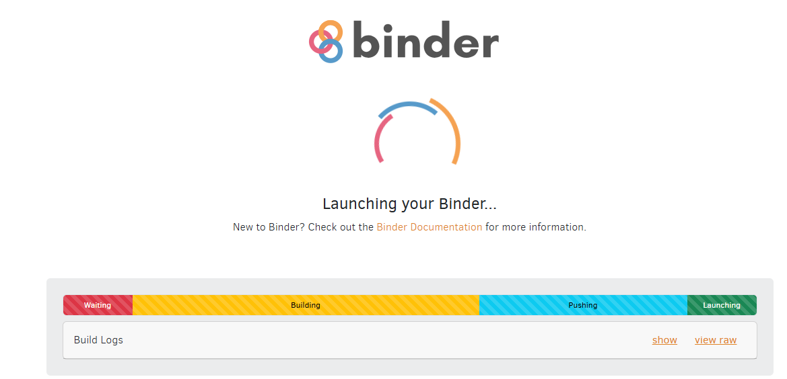
*✅ Green bar means your environment is ready in just a few seconds!*

### Step 3: Navigate to Class Activity 📚

Once Binder loads, you'll see the Jupyter Notebook interface. In the **left panel**, you'll see several folders:
- `assignment/` - Your homework assignments
- `class_activity/` - Lab tutorials and exercises  
- Various files (README.md, runtime.txt, etc.)

**Click on the `class_activity` folder** to access this week's content.

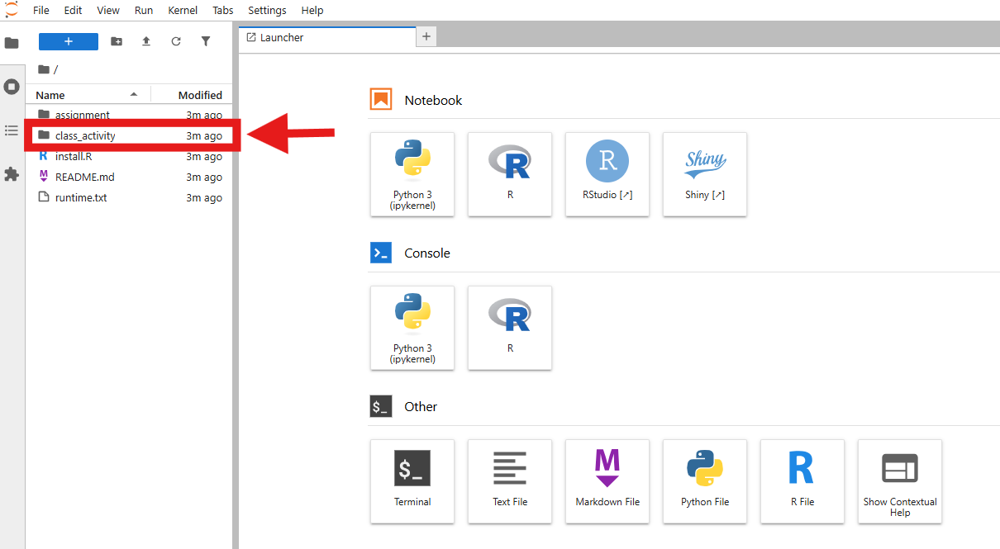
*👆 Click here to access your lab materials*

### Step 4: Open the Lab Notebook 📖

Inside the `class_activity` folder, **double-click** on `Week1_Introduction.ipynb` to open the interactive lab notebook.

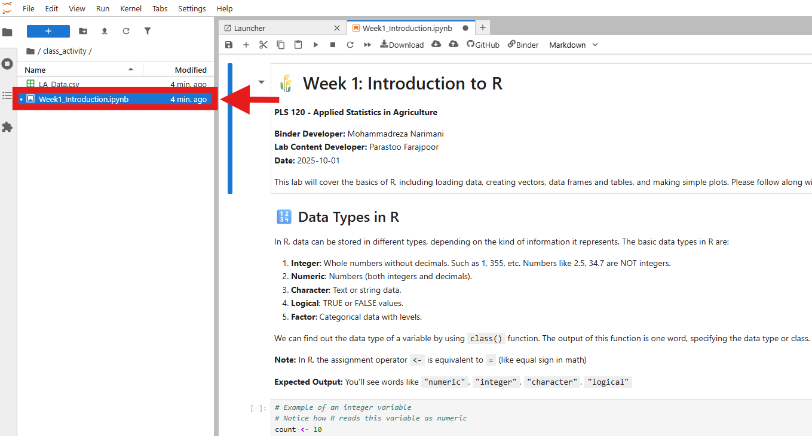
*👆 Double-click here to open the lab instructions and code*

### Step 5: Explore the Data (Optional) 📊

We've already uploaded the data for this lab! The file `LA_Data.csv` contains the statistics data. You can **double-click** on it to explore the data if you're curious.

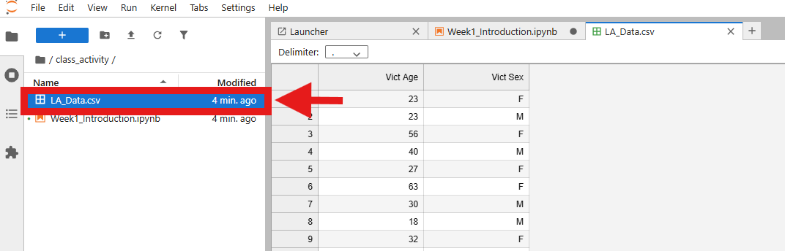
*👆 Click here to view the raw data (optional)*

---

## 💾 Saving Your Work

**⚠️ Important:** Binder environments are temporary! Always save your work locally.

### Download Your Notebook 📥

When you're done working, save your progress:

1. **Go back to main folder** - Click the folder icon in the left panel

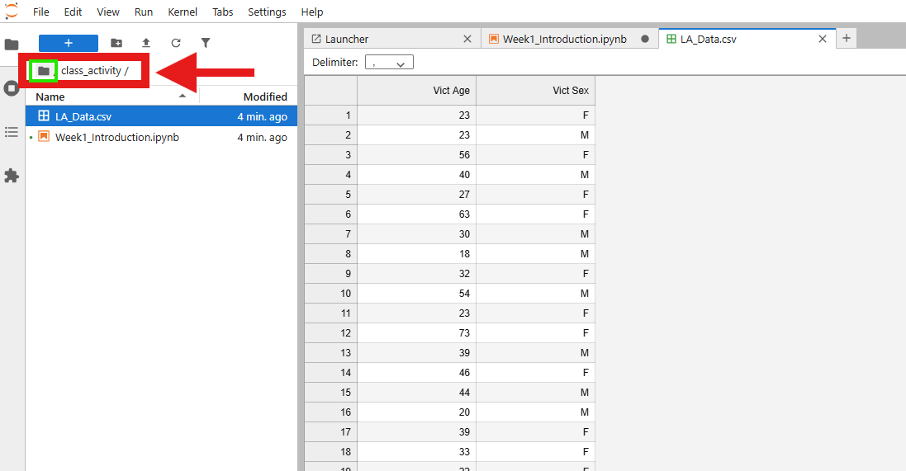
*👆 Click the folder icon to return to the main directory*

2. **Download your notebook** - Right-click on your `.ipynb` file and select "Download"

---

## 📝 Completing Assignments

### Step 1: Access Assignment Folder 📋

From the main directory, **click on the `assignment` folder** to access your homework.

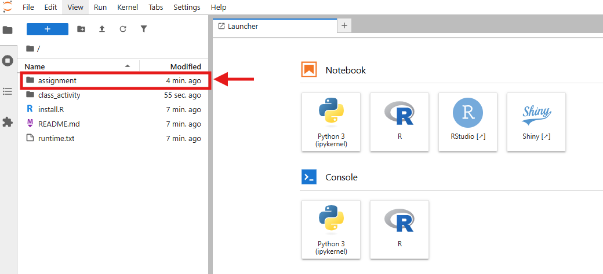
*👆 Click here to access assignment materials*

### Step 2: Open Assignment Notebook 📄

**Double-click** on `Assignment1.ipynb` to open your assignment.

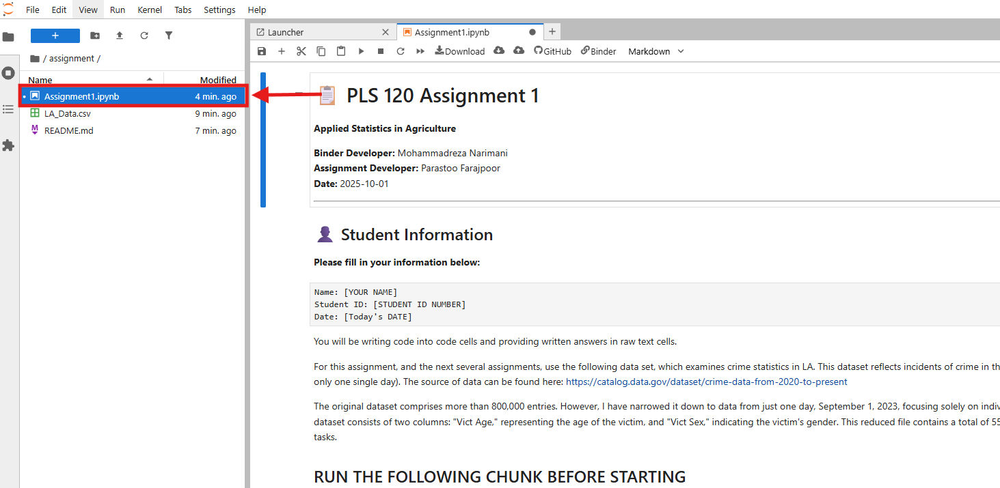
*👆 Double-click here to open your assignment*

### Step 3: Complete Your Work ✍️

Fill in all **code boxes** and **text boxes** carefully to answer all questions. Look for:
- ❓ Question mark emojis indicating questions to answer
- Code cells with hints in comments
- Raw text cells for your written responses

### Step 4: Download Your Completed Work 💾

#### Download Code File (.ipynb)

Click **File** → **Download** to save your notebook code.

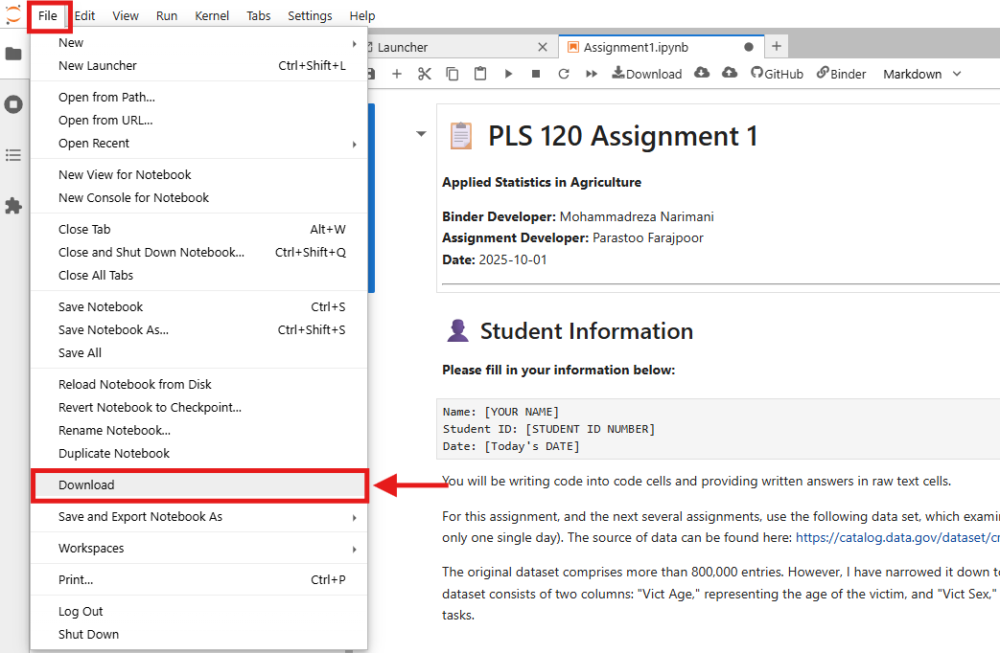
*👆 Download your .ipynb file for backup*

#### Export HTML/PDF Report 📄

For submission, you also need an HTML or PDF report:

Click **File** → **Save and Export Notebook As** → **HTML** (or PDF)

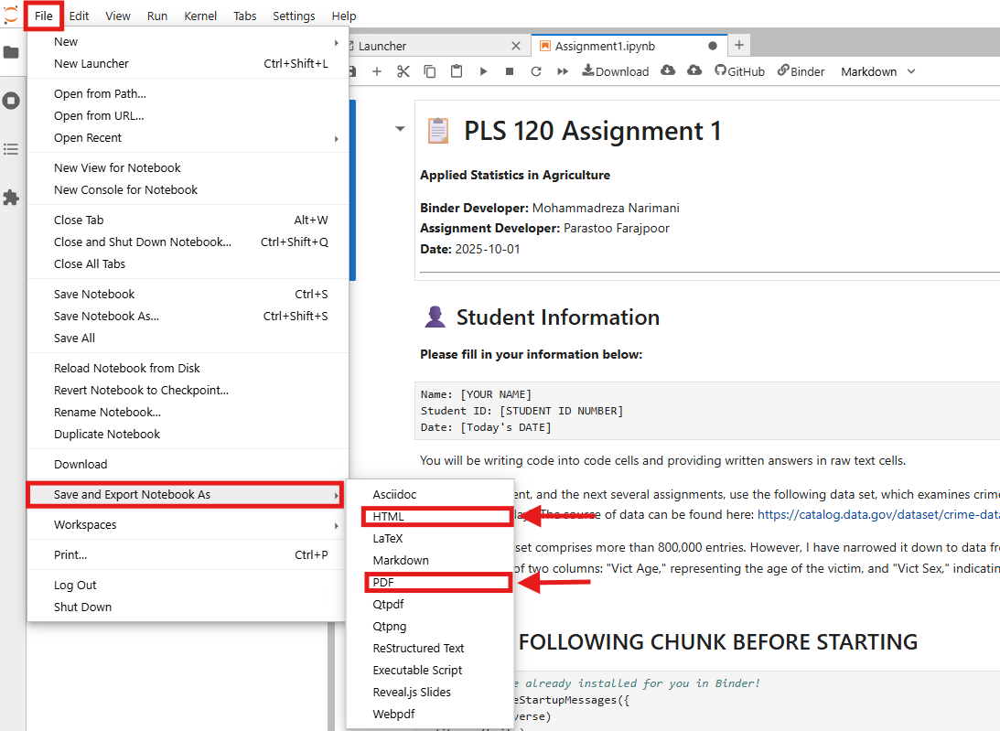
*👆 Export your completed assignment as HTML or PDF*

---

## ⚠️ Important: Saving Your Progress

**Do not close Binder if you have not saved your code or all your progress will be gone!**

If you want to take a break and continue your activity or assignment later:

### Save Your Work Before Closing 💾

Right-click on your code (`.ipynb`) file and click "Download" to make sure you have saved your code locally.

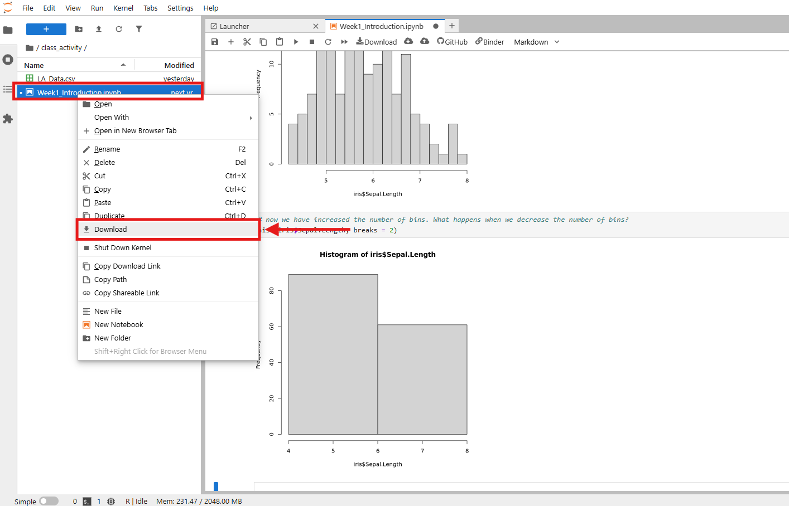
*👆 Right-click on your notebook file and download it before closing Binder*

### Continue Your Progress Later 🔄

When you open Binder again and want to continue your work:

1. Click the **Upload** button on the top ribbon
2. Find your saved code file locally on your computer
3. Upload your `.ipynb` file
4. Run your code cells again to see your previous outputs!

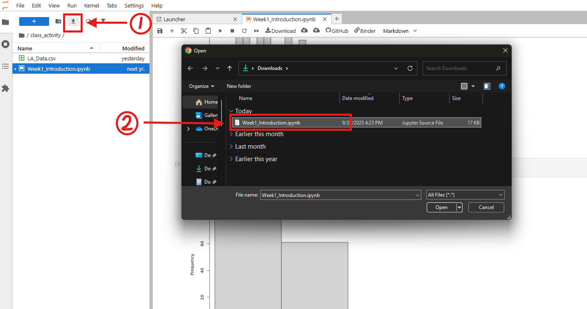
*👆 Use the Upload button to continue your work from where you left off*

---

## 📤 Submission Requirements

For each assignment, submit **TWO files** to UC Davis Canvas:

1. **📄 HTML/PDF Report** - Your formatted assignment with outputs
2. **💾 .ipynb File** - Your notebook code as backup

---

## ❓ Need Help?

### 📧 Contact Information

**Mohammadreza Narimani**  
📧 mnarimani@ucdavis.edu  
🏫 Department of Biological and Agricultural Engineering, UC Davis

### 🔧 Technical Issues

- **Binder won't load?** Try refreshing the page or clearing browser cache
- **Lost your work?** Always download files before closing Binder
- **Code not working?** Check for typos and make sure you've run all previous cells

### 📚 Learning Resources

- **R Documentation:** Use `?function_name` in code cells for help
- **Course Materials:** All tutorials are in the `class_activity` folder
- **Practice:** Try modifying the example code to learn more!

---

## 📋 What You'll Learn

✅ **R Programming Basics** - Variables, vectors, data frames  
✅ **Data Visualization** - Histograms, plots, charts  
✅ **Statistical Analysis** - Descriptive statistics, hypothesis testing  
✅ **Agricultural Applications** - Real-world data analysis  
✅ **Report Writing** - Professional statistical reports  

---

## 🌟 Tips for Success

### 💡 Best Practices

- **📖 Read instructions carefully** before starting each exercise
- **▶️ Run code cells in order** - later cells depend on earlier ones
- **💾 Save frequently** - Download your work regularly
- **🤔 Experiment** - Try modifying code to see what happens
- **❓ Ask questions** - Don't hesitate to reach out for help

### ⚡ Keyboard Shortcuts

- **Shift + Enter** - Run current cell and move to next
- **Ctrl + Enter** - Run current cell and stay in place
- **A** - Insert cell above
- **B** - Insert cell below
- **DD** - Delete current cell

---

## 🎉 Ready to Start?

Click the Binder badge at the top of this page to launch your first R programming session!

**Happy coding! 🚀🌾**

---

*Last updated: October 2025 | PLS 120 - Applied Statistics in Agriculture | UC Davis*